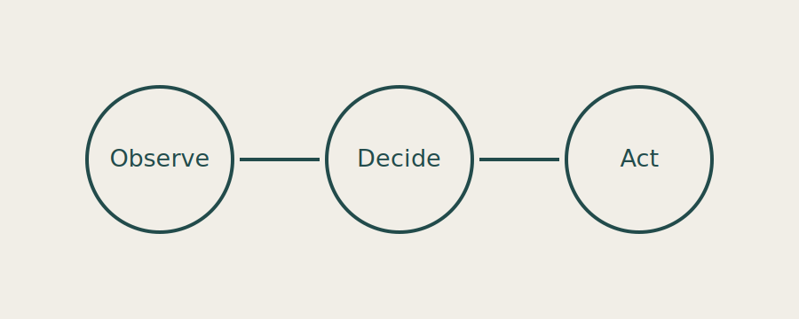

# AI Agents

An agent is a system that observes, decides, acts, and evaluates its work.

## The agent loop

1. Observe the current state.
2. Choose an action.
3. Evaluate the outcome.



## Reliability before autonomy

Good agents make uncertainty visible and keep people in control of consequential decisions.

```ts
const nextAction = await agent.decide(observations)
await tools.execute(nextAction)
```
